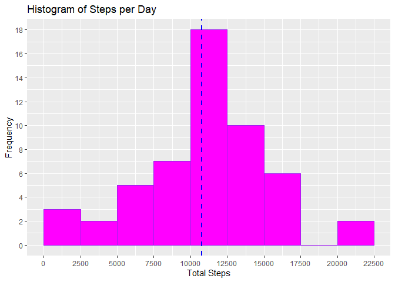
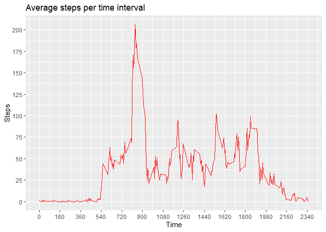
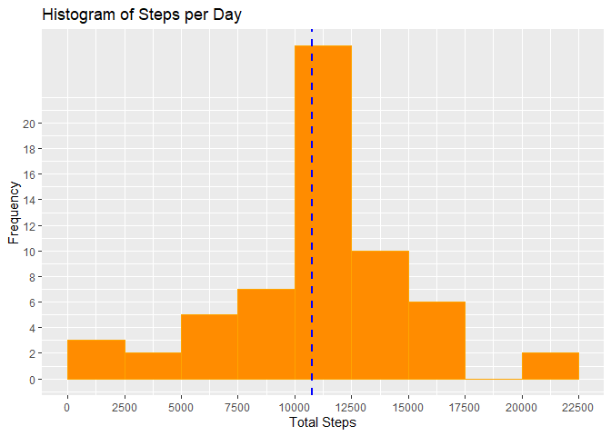
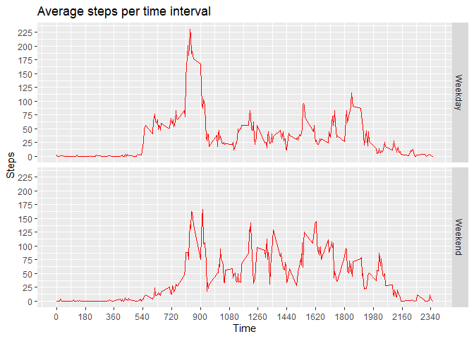

## Loading and preprocessing the data

```r
library(ggplot2)
data <- read.csv(unz("activity.zip", "activity.csv"))
head(data)
```

```
##   steps       date interval
## 1    NA 2012-10-01        0
## 2    NA 2012-10-01        5
## 3    NA 2012-10-01       10
## 4    NA 2012-10-01       15
## 5    NA 2012-10-01       20
## 6    NA 2012-10-01       25
```

```r
summary(data)
```

```
##      steps            date              interval     
##  Min.   :  0.00   Length:17568       Min.   :   0.0  
##  1st Qu.:  0.00   Class :character   1st Qu.: 588.8  
##  Median :  0.00   Mode  :character   Median :1177.5  
##  Mean   : 37.38                      Mean   :1177.5  
##  3rd Qu.: 12.00                      3rd Qu.:1766.2  
##  Max.   :806.00                      Max.   :2355.0  
##  NA's   :2304
```

## What is mean total number of steps taken per day?
From the summary of the data that I got using the summary() function, the mean and median was found to be 10765 and 10766 respectively. The histogram is also plotted which shows the number of steps in intervals of 2500 steps with the highest frequency.

```r
#Creating a new table of sum of steps on a specific date
dailySteps <- aggregate(data$steps,list(data$date), sum)
colnames(dailySteps) <- c("Date", "Steps")
head(dailySteps)
```

```
##         Date Steps
## 1 2012-10-01    NA
## 2 2012-10-02   126
## 3 2012-10-03 11352
## 4 2012-10-04 12116
## 5 2012-10-05 13294
## 6 2012-10-06 15420
```

```r
summary(dailySteps)
```

```
##      Date               Steps      
##  Length:61          Min.   :   41  
##  Class :character   1st Qu.: 8841  
##  Mode  :character   Median :10765  
##                     Mean   :10766  
##                     3rd Qu.:13294  
##                     Max.   :21194  
##                     NA's   :8
```

```r
hist <- ggplot(dailySteps, aes(Steps)) + 
        geom_histogram(boundary = 0, binwidth=2500,col="purple",fill="magenta")+
        ggtitle("Histogram of Steps per Day") + 
  geom_vline(aes(xintercept=mean(dailySteps$Steps, na.rm = TRUE)),
            color="blue", linetype="dashed", size=1)+
  xlab("Total Steps")+ ylab("Frequency") + scale_x_continuous(breaks = seq(0,25000,2500)) + scale_y_continuous(breaks= seq(0,20,2))
hist
```

```
## Warning: Use of `dailySteps$Steps` is discouraged. Use `Steps` instead.
```

```
## Warning: Removed 8 rows containing non-finite values (stat_bin).
```

<!-- -->

```r
mean(dailySteps$Steps, na.rm = TRUE)
```

```
## [1] 10766.19
```

```r
median(dailySteps$Steps, na.rm = TRUE)
```

```
## [1] 10765
```

## What is the average daily activity pattern?
At time interval 835, the average number of steps recorded across all days is the maximum.

```r
stepsper5 <- aggregate(steps~interval,data,mean, na.action=na.omit)
head(stepsper5)
```

```
##   interval     steps
## 1        0 1.7169811
## 2        5 0.3396226
## 3       10 0.1320755
## 4       15 0.1509434
## 5       20 0.0754717
## 6       25 2.0943396
```

```r
timeplot<-ggplot(stepsper5, aes(interval, steps))+geom_line(col="red")+ggtitle("Average steps per time interval")+xlab("Time")+ylab("Steps")+scale_x_continuous(breaks = seq(0,2400,180)) + scale_y_continuous(breaks= seq(0,250,25))
timeplot
```

<!-- -->

```r
# Summary of the steps recorded at a time interval 
summary(stepsper5$steps)
```

```
##    Min. 1st Qu.  Median    Mean 3rd Qu.    Max. 
##   0.000   2.486  34.113  37.383  52.835 206.170
```

```r
# Finding the time interval when steps is maximum
stepsper5$interval[which.max(stepsper5$steps)]
```

```
## [1] 835
```


## Inputing missing values
### Calculate and report the total number of missing values in the dataset

```r
# Counting the number of rows with NA
sum(is.na(data))
```

```
## [1] 2304
```
There are a total of 2304 missing values in the dataset.

### Device a strategy to fill in the missing values and create a new dataset that is equal to the original but with missing data filled in
The missing values will introduce bias into some calculations or summaries of the data. The strategy I used to fill in all the missing values in the dataset is to used the rounded up value of the average steps across all days at that specific time interval.
The code is as follow:

```r
# Replacing missing values 
NewData <- data
NewData$steps <- ifelse(is.na(NewData$steps), round(stepsper5$steps[match(NewData$interval, stepsper5$interval)],0),NewData$steps)
head(NewData)
```

```
##   steps       date interval
## 1     2 2012-10-01        0
## 2     0 2012-10-01        5
## 3     0 2012-10-01       10
## 4     0 2012-10-01       15
## 5     0 2012-10-01       20
## 6     2 2012-10-01       25
```
### Histogram of the total number of steps taken each day with new data
The new mean is 10766 which is the same as the old one.
The new median is 10762 which is lower than the median from the old data which is 10765. 


```r
# Preparing the data
newDailySteps <-aggregate(NewData$steps,list(NewData$date),sum)
colnames(newDailySteps) <- c("Date","Steps")
# Plotting the Histogram
newHist <- ggplot(newDailySteps, aes(Steps)) + 
        geom_histogram(boundary = 0, binwidth=2500,col="orange",fill="darkorange")+
        ggtitle("Histogram of Steps per Day") + 
  geom_vline(aes(xintercept=mean(newDailySteps$Steps, na.rm = TRUE)),
            color="blue", linetype="dashed", size=1)+
  xlab("Total Steps")+ ylab("Frequency") + scale_x_continuous(breaks = seq(0,25000,2500)) + scale_y_continuous(breaks= seq(0,20,2))
newHist
```

```
## Warning: Use of `newDailySteps$Steps` is discouraged. Use `Steps` instead.
```

<!-- -->

```r
# Summary of the new data
summary(newDailySteps)
```

```
##      Date               Steps      
##  Length:61          Min.   :   41  
##  Class :character   1st Qu.: 9819  
##  Mode  :character   Median :10762  
##                     Mean   :10766  
##                     3rd Qu.:12811  
##                     Max.   :21194
```

```r
#Summary of the old data
summary(dailySteps)
```

```
##      Date               Steps      
##  Length:61          Min.   :   41  
##  Class :character   1st Qu.: 8841  
##  Mode  :character   Median :10765  
##                     Mean   :10766  
##                     3rd Qu.:13294  
##                     Max.   :21194  
##                     NA's   :8
```
## Are there differences in activity patterns between weekdays and weekends?
### Create a new factor variable in the dataset with two levels - 'Weekday' and 'Weekend' indicating whether a given date is a weekday or weekend

```r
# Formatting the data
NewData$date <- as.Date(NewData$date, format = "%Y-%m-%d")
# creating a column with weekdays name
NewData$weekday <- weekdays(NewData$date)
NewData$DayType <- ifelse(NewData$weekday == "Saturday"| NewData$weekday == "Sunday", "Weekend", "Weekday")
head(NewData)
```

```
##   steps       date interval weekday DayType
## 1     2 2012-10-01        0  Monday Weekday
## 2     0 2012-10-01        5  Monday Weekday
## 3     0 2012-10-01       10  Monday Weekday
## 4     0 2012-10-01       15  Monday Weekday
## 5     0 2012-10-01       20  Monday Weekday
## 6     2 2012-10-01       25  Monday Weekday
```
### Time series plot of the 5-minute interval and the average number of steps taken(x-axis), averaged across all weekday days or weekend days(y-axis)

```r
newstepsper5 <- aggregate(steps~interval+DayType,NewData,mean, na.action=na.omit)
head(newstepsper5)
```

```
##   interval DayType      steps
## 1        0 Weekday 2.28888889
## 2        5 Weekday 0.40000000
## 3       10 Weekday 0.15555556
## 4       15 Weekday 0.17777778
## 5       20 Weekday 0.08888889
## 6       25 Weekday 1.57777778
```

```r
newTimePlot<-ggplot(newstepsper5, aes(interval, steps))+geom_line(col="red")+ggtitle("Average steps per time interval")+xlab("Time")+ylab("Steps")+scale_x_continuous(breaks = seq(0,2400,180)) + scale_y_continuous(breaks= seq(0,250,25))+facet_grid(DayType ~ .)
newTimePlot
```

<!-- -->
